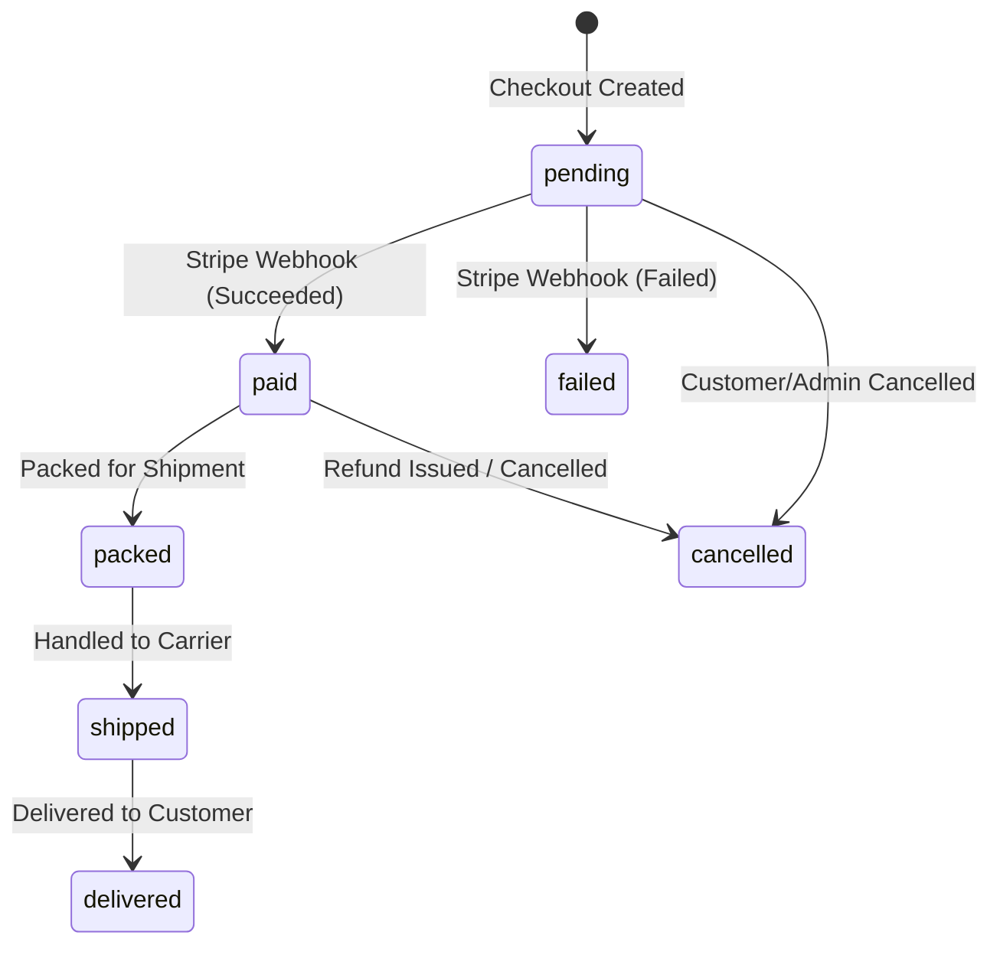

# Orders Implementation & Lifecycle Documentation

This document explains the order states, authorization access guards, and state machine lifecycle transitions in the E-Commerce platform.

---

## Order State Machine Lifecycle

An order is created immediately upon checkout with a status of `pending`. It then transitions through the following lifecycle stages based on Stripe events and operational status updates:

### State Definitions:
1. **`pending`**: Initial checkout completed; waiting for payment processing.
2. **`paid`**: Payment confirmed by Stripe webhook signature validation.
3. **`packed`**: Package assembled, ready to leave warehouse.
4. **`shipped`**: Handled to shipping courier; tracking ID issued.
5. **`delivered`**: Package arrived at billing shipping address.
6. **`cancelled`**: Transaction terminated or voided.
7. **`failed`**: Stripe payment card processing failed.

---

## API Router Endpoints

All order routing requires user authentication and checks ownership rules:

### 1. `GET /orders`
- **Scope**: Private (Authenticated user).
- **Description**: Returns all orders placed by the current user sorted in descending chronological order (`createdAt: -1`).
- **Response**: List of Order documents with populated product detail fields.

### 2. `GET /orders/:id`
- **Scope**: Private (Authenticated user).
- **Description**: Returns the details of a specific order ID.
- **Authorization Guard**: The system compares `req.user.userId` with the order's `userId`. If they do not match, the request is rejected with `403 Forbidden` ("You are not authorized to view this order.").

### 3. `PUT /orders/:id/status`
- **Scope**: Private (Authenticated user / Admin).
- **Description**: Updates the order status to a new value.
- **Validation**: Rejects invalid status strings with `400 Bad Request`.

---

## Developer Status Simulator Control

For ease of testing and debugging the delivery step transitions on development/staging builds, the **Order Details Page** contains an interactive drop-down menu that triggers `PUT /orders/:id/status` to instantly change the order's state and update the delivery progress timeline.
