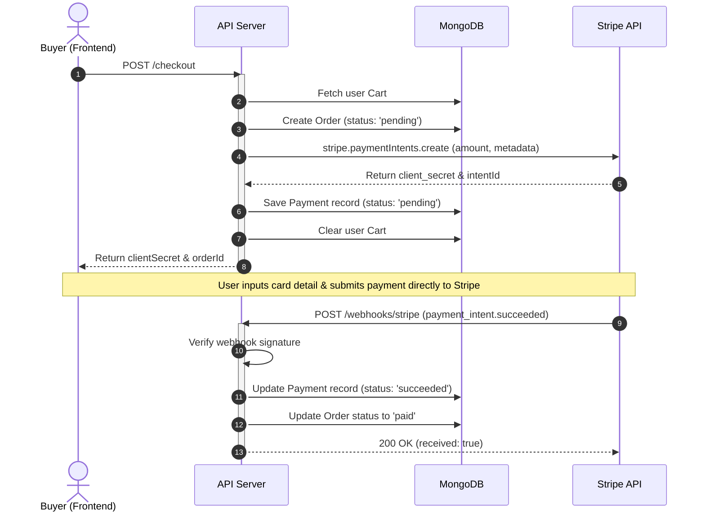

# Payments Implementation Documentation

This document explains the technical flow, payment calculation formulas, and state lifecycle transitions of the Payment and Checkout system.

---

## Architecture Flow

The payment flow leverages **Stripe Payment Intents** in combination with local Mongoose models to capture transaction logs securely.



---

## Database Schemas

### 1. Payment Schema (`PaymentModel`)
Tracks Stripe payment intent transactions.

| Field | Type | Description |
|---|---|---|
| `orderId` | ObjectId | Reference to the associated Order document. |
| `paymentIntentId` | String | Unique Stripe Payment Intent Identifier. |
| `amount` | Number | Total transaction value in EGP. |
| `status` | String | Transaction status: `pending`, `succeeded`, `failed`. |

### 2. Order Schema Updates (`OrderModel`)
Orders are initialized as `pending` upon checkout creation, and transitioned by Stripe webhook outcomes:
- **Success:** Status transitions to `paid`.
- **Failure:** Status transitions to `failed`.

---

## Webhook Signature Verification

The webhook endpoint verifies all incoming Stripe events securely using Stripe's native HMAC-SHA256 signature verification helper. Express parses raw buffers using customized verify middleware:

```typescript
app.use(express.json({
  verify: (req, res, buf) => {
    req.rawBody = buf;
  }
}));
```
This enables `stripe.webhooks.constructEvent(rawBody, signatureHeader, webhookSecret)` to run correctly.
